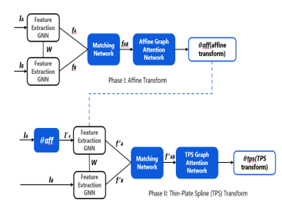
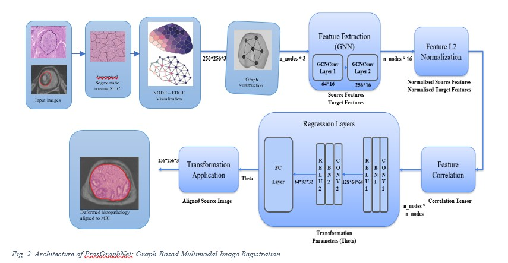
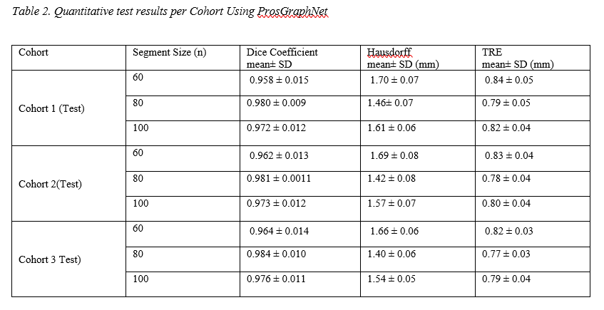

# ProsGraphNet: Superpixel-Graph Neural Network for Deformable Registration of Prostate MRI and Histological Images

[](https://opensource.org/licenses/MIT)
[](https://www.python.org/downloads/)
[](https://pytorch.org/)




> **Accurate registration of whole-mount histopathology with preoperative MRI**  
> Samana Jafri, Dr. Gajanan Birajdar  
> Ramrao Adik Institute of Technology (RAIT), D Y Patil University

## Abstract
Prostate cancer is the second leading cause of cancer-related deaths in men worldwide. ProsGraphNet presents a novel graph-based deep learning framework for multimodal deformable registration between axial T2-weighted MRI and histology sections. By constructing superpixel-based graphs from both modalities and employing spatially guided message passing, ProsGraphNet achieves state-of-the-art registration accuracy across three independent prostate cancer cohorts:

| Metric              | Cohort 1     | Cohort 2     | Cohort 3     |
|---------------------|--------------|--------------|--------------|
| **Dice Coefficient** | 0.980 ± 0.009 | 0.981 ± 0.011 | 0.984 ± 0.010 |
| **Hausdorff Dist**   | 1.46 ± 0.07 mm | 1.42 ± 0.08 mm | 1.40 ± 0.06 mm |
| **TRE**             | 0.79 ± 0.05 mm | 0.78 ± 0.04 mm | 0.77 ± 0.03 mm |

## Features
- 🧠 Graph-based representation of MRI/histology superpixels
- 🔗 Spatially guided message passing for deformation learning
- 🚀 5x faster than RAPHIA pipeline
- 🧪 Validated on 152 patients across 3 cohorts
- 🏆 State-of-the-art registration accuracy

## Installation
```bash
# Clone repository
git clone https://github.com/[USERNAME]/ProsGraphNet.git
cd ProsGraphNet

# Create conda environment (Python 3.8+)
conda create -n prosgraphnet python=3.8
conda activate prosgraphnet

# Install dependencies
pip install -r requirements.txt

# Install PyTorch Geometric (compatible with your CUDA version)
pip install torch_geometric

## Quick Start
### 1. Data Preparation
Download datasets from TCIA:
- [Cohort 1: Stanford Prostate MRI-Histo](https://doi.org/10.7937/XXXX)
- [Cohort 2: Prostate Fused-MRI Pathology](https://doi.org/10.7937/YOUR_DOI)
- [Cohort 3: NCI Prostate MRI](https://doi.org/10.7937/YOUR_DOI)

Organize data:
```
data/
├── cohort1/
│   ├── patient1/
│   │   ├── t2w_mri.nii.gz
│   │   ├── histology.tif
│   │   └── mask.nii.gz
├── cohort2/
...
```

### 2. Training
```bash
python train.py \
  --data_dir ./data \
  --cohorts cohort1 cohort2 \
  --superpixels 80 \
  --epochs 100 \
  --lr 0.005 \
  --output_dir ./models
```

### 3. Inference
```bash
python register.py \
  --model_path ./models/best_model.pth \
  --mri_path ./data/cohort3/patientX/t2w_mri.nii.gz \
  --histo_path ./data/cohort3/patientX/histology.tif \
  --output_dir ./results \
  --superpixels 80
```

## Results
### Quantitative Performance
| Method       | Dice ↑ | HD95 (mm) ↓ | TRE (mm) ↓ | Time (min) ↓ |
|--------------|--------|-------------|------------|--------------|
| RAPSODI      | 0.91   | 2.3         | 2.1        | 12.0         |
| RAPHIA       | 0.97   | 1.67        | 1.02       | 8.5          |
| **ProsGraphNet** | **0.98** | **1.43**    | **0.78**   | **2.1**      |

### Visualization


## Pretrained Models
Download our best-performing models:
- [ProsGraphNet (n=80 superpixels)](https://drive.google.com/your-model-link)
- [ProsGraphNet (n=60 superpixels)](https://drive.google.com/your-model-link)
- [ProsGraphNet (n=100 superpixels)](https://drive.google.com/your-model-link)

## Citation
```bibtex
@article{jafri2024prosgraphnet,
  title={ProsGraphNet: A Superpixel-Graph Neural Network for Deformable Registration of Prostate MRI and Histological Images},
  author={Jafri, Samana and Birajdar, Gajanan},
  journal={Biomedical Signal Processing and Control},
  volume={XX},
  pages={XXXXX},
  year={2024},
  publisher={Elsevier}
}
```

## License
This project is licensed under the MIT License - see the [LICENSE](LICENSE) file for details.

## Contact
For questions and collaborations:
- Samana Jafri: samana.jafri@rait.ac.in
- Dr. Gajanan Birajdar: gbirajdar@rait.ac.in
```